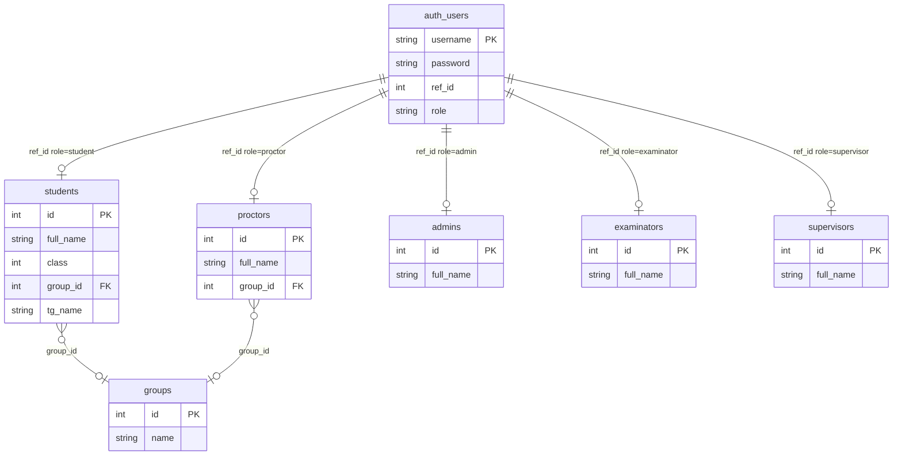

# 01. Виды учёток (роли пользователей)

## 1. Обзор

В CPM все пользователи входят в систему через **единую таблицу логинов** `auth_users`, а профиль (имя, группа и т.д.) хранится в **отдельной таблице по роли**. Пять ролей: **student**, **proctor**, **admin**, **examinator**, **supervisor**.

После входа выдаётся **JWT** (и cookie `auth_token`). Фронтенд по полю `role` открывает соответствующий кабинет. Права на API задаются декораторами `require_role` и `require_self_or_role` на уровне blueprint’ов.

Учётки **не создаются одним универсальным API**: через бэкенд полностью заводится только **студент**; остальные роли, как правило, появляются в БД вне этого API (SQL / админка), но удаляются и частично читаются через API.

---

## 2. Функциональная модель

### 2.1. Роли и назначение

| Роль | Кто это | Кабинет (фронт) | Основная зона ответственности |
|------|---------|-----------------|-------------------------------|
| **student** | Ученик | StudentCabinet | Свои ДЗ, тесты, экзамены, посещаемость, прогресс, тренировка (карточки), расписание, заявки на отгул |
| **proctor** | Проктор группы | ProctorCabinet | Домашки и таблица ОВ **своей** группы, список студентов группы |
| **admin** | Администратор | AdminCabinet | Полное управление: пользователи, группы, расписание, ДЗ, тесты, экзамены, посещаемость, скан QR, отгулы, рейтинги |
| **examinator** | Экзаменатор | ExaminatorCabinet | Проведение экзаменов (UI `Examiner`) |
| **supervisor** | Супервайзер | SupervisorCabinet | Обзор рейтингов, таблица ОВ, посещаемость (без полного админ-CRUD) |

### 2.2. Кто что делает с учётками

| Действие | student | proctor | admin | examinator | supervisor |
|----------|---------|---------|-------|------------|------------|
| Вход в систему | ✓ | ✓ | ✓ | ✓ | ✓ |
| Создание учётки через API | — | — | только **студент** | — | — |
| Список пользователей по роли | — | — | ✓ (кроме admin) | — | — |
| Редактирование профиля студента | — | — | ✓ | — | — |
| Назначение в группу (student/proctor) | — | — | ✓ | — | — |
| Удаление любой роли | — | — | ✓ | — | — |
| Просмотр студентов своей группы | — | ✓ | ✓ | — | — |

### 2.3. Группы и привязка к учёткам

- **Студент** и **проктор** могут иметь `group_id` (учебная группа). При создании студента группа **не назначается** (`NULL`) — назначает админ.
- В одной группе может быть **много студентов** и, по логике кода, **один проктор** (запрос проктора группы возвращает одну запись).
- **Админ, экзаменатор, супервайзер** к группам в БД не привязаны.

### 2.4. Доступ к остальным модулям (кратко, для контекста роли)

Ниже — не полный список API, а **типовые** права по ролям в текущем коде:

| Модуль | student | proctor | admin | examinator | supervisor |
|--------|---------|---------|-------|------------|------------|
| Домашки | свои | группа | всё | — | таблица ОВ |
| Тесты | свои сессии | — | создание/управление | — | — |
| Рейтинги | свой просмотр* | просмотр* | всё | — | просмотр + списки |
| Расписание | чтение | — | CRUD | — | — |
| Карточки Platon | свои | student_id своей группы | всё | — | — |
| Экзамены (API) | свои | — | управление | **нет `@require_role`** | — |
| Отгулы | свои заявки | — | обработка | — | — |

\* через `require_self_or_role` вместе с admin / proctor / supervisor где указано в blueprint.

**Особенность examinator:** роль есть в `auth_users` и JWT, но в blueprint’ах **ни один эндпоинт не требует роль `examinator`**. Экзаменаторский UI, вероятно, опирается на отдельные маршруты без жёсткой проверки роли или на публичные/общие методы — при доработке безопасности это стоит явно закрыть.

### 2.5. Сценарии

**Вход.** Пользователь вводит логин/пароль → проверка `auth_users` → загрузка строки из таблицы роли → JWT + cookie → фронт вызывает `/api/aun` при перезагрузке страницы.

**Новый студент.** Админ создаёт карточку: ФИО, класс (9/10/11), опционально Telegram → система генерирует логин и пароль → запись в `students` + `auth_users` → админ передаёт ученику credentials.

**Привязка к группе.** Админ назначает `group_id` студенту и/или проктора через API групп.

**Удаление.** Админ удаляет сущность и связанную строку `auth_users` (каскад по связанным данным зависит от FK в реальной БД — в репозитории DDL нет).

**Валидация по Telegram.** Публичный эндпоинт ищет студента по `tg_name` и может вернуть логин/пароль (используется для онбординга; с точки зрения безопасности — чувствительный endpoint).

---

## 3. Техническая модель

### 3.1. Архитектура данных

> **Примечание:** DDL пользовательских таблиц в репозитории отсутствует. Схема — **реконструкция по SQL в коде**. Типы и индексы уточнять на сервере MySQL (`MYSQL_DATABASE=cpm`).

### 3.2. Сущности и атрибуты

#### `auth_users` — учётная запись для входа

| Атрибут | Описание |
|---------|----------|
| `username` | Логин (уникальный при создании студента) |
| `password` | Хеш Werkzeug (`generate_password_hash`) или legacy plaintext |
| `ref_id` | `id` записи в таблице роли |
| `role` | `student` \| `proctor` \| `admin` \| `examinator` \| `supervisor` |

**Связь:** полиморфная — пара `(role, ref_id)` указывает на одну из пяти таблиц (`ROLE_TABLES` в `auth/auth.py`).

**Операции в коде:** SELECT при логине; INSERT только при `add_student`; DELETE при `delete_user`; UPDATE логина/пароля **не реализован**.

#### `students`

| Атрибут | Описание |
|---------|----------|
| `id` | PK |
| `full_name` | ФИО |
| `class` | 9, 10 или 11 |
| `group_id` | FK на `groups.id`, nullable |
| `tg_name` | Telegram, nullable |

#### `proctors`

| Атрибут | Описание |
|---------|----------|
| `id` | PK |
| `full_name` | ФИО |
| `group_id` | FK на группу, nullable |

#### `examinators`, `supervisors`

| Атрибут | Описание |
|---------|----------|
| `id` | PK |
| `full_name` | ФИО |

#### `admins`

| Атрибут | Описание |
|---------|----------|
| `id` | PK |
| `full_name` | ФИО (из `SELECT *` при логине) |

#### `groups` (контекст для student/proctor)

| Атрибут | Описание |
|---------|----------|
| `id` | PK |
| `name` | Название группы |

### 3.3. JWT и сессия

**Payload токена** (`jwt_auth.generate_token`):

| Claim | Источник |
|-------|----------|
| `role` | роль |
| `id` | id в таблице роли |
| `full_name` | из таблицы роли |
| `group_id` | только для `student` и `proctor`; иначе отсутствует / null |
| `exp`, `iat` | срок жизни (`JWT_EXPIRATION_HOURS`, по умолчанию 24 ч) |

**Передача токена:**

1. Header `Authorization: Bearer <token>`
2. Cookie `auth_token` (HttpOnly, SameSite=Lax; `Secure` на production вне localhost)

**Декораторы** (`jwt_auth.py`):

| Декоратор | Поведение |
|-----------|-----------|
| `require_auth` | 401 без валидного JWT; в handler — `current_user` |
| `require_role(*roles)` | 403, если `current_user.role` не в списке |
| `require_self_or_role(param, *roles)` | доступ, если `current_user.id == requested_id` **или** роль в списке; ID из kwargs или JSON body |

**Логин** (`auth.auth`): `auth_users` → проверка пароля → `SELECT * FROM {role_table} WHERE id = ref_id` → объект `{ role, id, full_name, group_id? }`.

---

## 4. API

Префикс blueprint’ов auth / users / students / groups: **`/api`**.

### 4.1. Авторизация

Blueprint: `auth_bp` → `cpm_back/blueprints/auth_bp.py`

#### `POST /api/auth`

| | |
|---|---|
| **Auth** | Не требуется |
| **Body** | `{ "login": string, "password": string }` |
| **Успех 200** | `{ "status": true, "message", "user": { role, id, full_name, group_id? }, "token": string }` + Set-Cookie `auth_token` |
| **Ошибки** | 400 — пустые поля; 401 — неверные credentials |
| **Сервис** | `auth.auth()` → `generate_token()`, `set_auth_cookie()` |

#### `POST /api/logout`

| | |
|---|---|
| **Auth** | Не требуется |
| **Body** | — |
| **Успех 200** | `{ "status": true, "message" }` + очистка cookie |
| **Сервис** | `clear_auth_cookie()` |

#### `POST /api/aun` (authenticate user now)

| | |
|---|---|
| **Auth** | `require_auth` |
| **Body** | — |
| **Успех 200** | `{ "status": true, "role", "entity_id", "full_name", "group_id" }` |
| **Ошибка** | 401 — нет/просрочен токен |
| **Назначение** | Восстановление сессии на фронте без повторного логина |

---

### 4.2. Пользователи по роли (admin)

Blueprint: `users_bp` → `cpm_back/blueprints/users_bp.py`

#### `POST /api/get-users-by-role`

| | |
|---|---|
| **Auth** | `admin` |
| **Body** | `{ "role": "student" \| "proctor" \| "examinator" \| "supervisor" }` |
| **Успех** | `{ "status": true, "res": [ ... ] }` |
| **Ошибка** | 400 — нет `role`; роль `admin` → `{ "status": false, "error": "Invalid role provided." }` |
| **Сервис** | `get_users_by_role.py` |

**Формат `res` по роли:**

- `student`: `{ id, full_name, group_id, class, tg_name }`
- `proctor`: `{ id, full_name, group_id }`
- `examinator`, `supervisor`: `{ id, full_name }`

#### `POST /api/delete-user`

| | |
|---|---|
| **Auth** | `admin` |
| **Body** | `{ "role": string, "userId": number }` — `role` как в `delete_user` (student, proctor, admin, examinator, supervisor) |
| **Успех** | `{ "status": true }` |
| **Сервис** | `delete_user.py`: `DELETE FROM {table} WHERE id = ?` затем `DELETE FROM auth_users WHERE role = ? AND ref_id = ?` |

---

### 4.3. Студенты

Blueprint: `students_bp` → `cpm_back/blueprints/students_bp.py`

#### `GET /api/get-students`

| | |
|---|---|
| **Auth** | `admin` |
| **Сервис** | `get_all_students()` |

#### `POST /api/student-group-filter`

| | |
|---|---|
| **Auth** | `admin`, `proctor` |
| **Body** | `{ "id": group_id }` |
| **Сервис** | `get_student_ids_and_names_by_group()` |

#### `POST /api/get-class-name-by-studID`

| | |
|---|---|
| **Auth** | `require_self_or_role('student_id', 'admin', 'proctor')` |
| **Body** | `{ "student_id": number }` |
| **Сервис** | `get_student_by_id()` |

#### `POST /api/add-student`

| | |
|---|---|
| **Auth** | `admin` |
| **Body** | `{ "full_name", "class": 9\|10\|11, "tg_name"?: string }` |
| **Успех** | `{ "status": true, "message", "student_data": { student_id, full_name, class, login, password, group_id: null, tg_name } }` |
| **Логика** | Генерация логина `{первая буква имени}{фамилия}{класс}[счётчик]`; пароль 8 символов; INSERT `students` + `auth_users` |
| **Сервис** | `add_student.py` |

#### `PUT /api/edit-student`

| | |
|---|---|
| **Auth** | `admin` |
| **Body** | `{ "student_id", "full_name"?, "class"?, "group_id"?, "tg_name"? }` — хотя бы одно поле кроме id |
| **Сервис** | `edit_student.py` |

#### `POST /api/validate-student-by-tg`

| | |
|---|---|
| **Auth** | **Нет** (публичный) |
| **Body** | `{ "tg_name": string }` |
| **Сервис** | `validate_student_by_tg.py` — JOIN `students` + `auth_users`; при успехе может вернуть учётные данные |
| **Ответ** | 200 / 404 |

---

### 4.4. Группы (привязка student / proctor)

Blueprint: `groups_bp` → `cpm_back/blueprints/groups_bp.py`  
Все маршруты: **`admin`**.

| Метод | Путь | Body / параметры | Сервис |
|-------|------|------------------|--------|
| GET | `/api/get-groups-students` | — | `merge_groups_students_proctors()` |
| GET | `/api/get-groups` | — | `get_all_groups()` |
| GET | `/api/get-unsigned-proctors-students` | — | `get_unassigned_students_and_proctors()` |
| POST | `/api/change-group-student` | `{ studentId, groupId }` | `assign_student_to_group()` |
| POST | `/api/change-group-proctor` | `{ proctorId, groupId }` | `assign_proctor_to_group()` |
| POST | `/api/remove-groupd-id-student` | `{ studentId }` | `reset_group_for_user('student', …)` |
| POST | `/api/remove-groupd-id-proctor` | `{ proctorId }` | `reset_group_for_user('proctor', …)` |

> В путях опечатка `groupd` — сохранена как в коде API.

---

### 4.5. Сводка CRUD учёток через API

| Операция | student | proctor | admin | examinator | supervisor |
|----------|---------|---------|-------|------------|------------|
| Create | `POST /api/add-student` | — | — | — | — |
| Read (список) | `get-users-by-role`, `get-students` | `get-users-by-role` | — | `get-users-by-role` | `get-users-by-role` |
| Update профиля | `PUT /api/edit-student` | — | — | — | — |
| Update группы | `change-group-student` | `change-group-proctor` | — | — | — |
| Delete | `POST /api/delete-user` | то же | то же | то же | то же |
| Смена пароля / логина | — | — | — | — | — |

---

## 5. Ключевые файлы в коде

| Назначение | Путь |
|------------|------|
| Логин, маппинг ролей | `cpm_back/auth/auth.py` |
| JWT, декораторы, cookie | `cpm_back/auth/jwt_auth.py` |
| Роуты auth | `cpm_back/blueprints/auth_bp.py` |
| Список / удаление | `cpm_back/blueprints/users_bp.py` |
| CRUD студентов | `cpm_back/blueprints/students_bp.py` |
| Группы | `cpm_back/blueprints/groups_bp.py` |
| Создание студента | `cpm_back/services/serv/add_student.py` |
| Удаление | `cpm_back/services/serv/delete_user.py` |
| Список по роли | `cpm_back/services/serv/get_users_by_role.py` |

---

## 6. Открытые вопросы / долг документации

- Выгрузить реальный DDL таблиц `auth_users`, `students`, `proctors`, … с прод-БД и вставить в раздел 3.
- Зафиксировать политику создания proctor / admin / examinator / supervisor (вне API).
- Уточнить модель доступа **examinator** к exam API и закрыть пробел в `@require_role`.
- Документировать `validate-student-by-tg` с точки зрения безопасности (rate limit, маскирование пароля).

Следующий раздел: **[02-domashnie-zadaniya.md](./02-domashnie-zadaniya.md)** (планируется).
