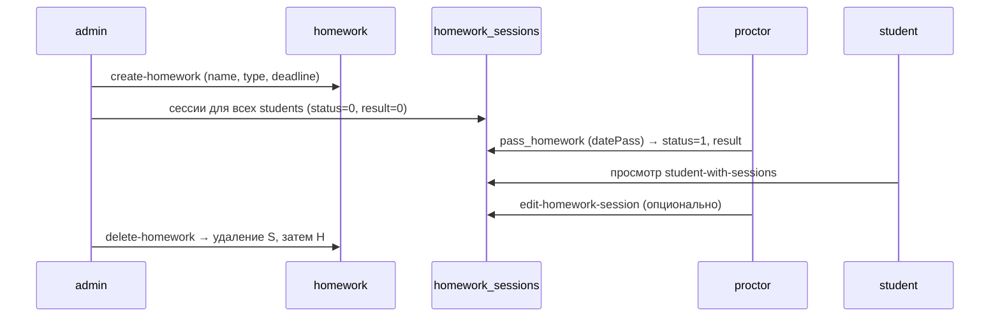

# 02. Домашние задания

## 1. Обзор

Модуль управляет **домашними заданиями (ДЗ)** учебного центра: справочник заданий с типом и дедлайном, **сессии выполнения** по каждому студенту (статус, балл, дата сдачи). Отдельной таблицы «результатов» нет — всё хранится в `homework_sessions`.

Типы в коде явно выделяются **`ОВ`** и **`ДЗНВ`** (сводная «таблица ОВ»); остальные типы — произвольные строки для фильтрации. Балл за сдачу: **100 минус 5 за каждый день просрочки** после `deadline` (минимум 0).

Blueprint: `homework_bp`, префикс `/api`. Сервисы: `cpm_back/services/serv/*homework*`.

---

## 2. Функциональная модель

### 2.1. Участники и зоны ответственности

| Роль | Что делает | Что видит |
|------|------------|-----------|
| **admin** | Создаёт и удаляет ДЗ; смотрит все результаты; может отмечать сдачу и править сессии (как проктор) | Полные отчёты, пагинация по ДЗ и студентам, OV-таблица |
| **proctor** | Отмечает сдачу студентов **своей группы**, правит сессии | Список сессий по `proctorId` + `homeworkId`, ДЗ студентов (любой `studentId`), OV-таблица |
| **student** | **Не сдаёт ДЗ через API** — только просмотр | Свои задания, статус «ДЗ сдано» / «ДЗ не сделано», балл |
| **supervisor** | Не управляет ДЗ | Только **OV-таблица** (типы ОВ и ДЗНВ) |
| **Без входа** | — | Список всех ДЗ (`GET /get-homeworks`) |

> **Важно:** сдача в системе — это действие **проктора или админа** (`pass_homework` / `edit-homework-session`), а не самостоятельная загрузка студентом.

### 2.2. Жизненный цикл ДЗ



1. **Создание** — админ задаёт название, тип, дедлайн → запись в `homework` → для **каждого** студента из `students` создаётся сессия `(status=0, result=0)`.
2. **Работа в группе** — проктор открывает сессии по своему `proctorId` и выбранному `homeworkId` (студенты группы; при отсутствии сессии — виртуальная строка с `id: null`).
3. **Отметка сдачи** — проктор/админ передаёт `datePass` (ISO `YYYY-MM-DD`); система ставит `status=1`, считает `result`, сохраняет `date_pass`.
4. **Правка** — изменение балла, даты, статуса вручную; при смене даты балл пересчитывается по той же формуле.
5. **Удаление** — админ удаляет все сессии задания, затем само задание.

### 2.3. Оценка и статусы (бизнес-логика)

**Балл при сдаче** (`pass_homework`, пересчёт в `edit_homework_session` при смене `datePass`):

- База: **100**
- Если `date_pass > deadline`: `result = 100 − 5 × (дней просрочки)`, не ниже **0**
- Ручной `result` в редактировании: ограничение **0–100**

**Статус в БД** (`homework_sessions.status`):

| Значение | Смысл |
|----------|--------|
| `0` | Не сдано |
| `1` | Сдано |

**Тексты для админских отчётов** (вычисляются в SQL):

| Условие | `status_text` |
|---------|----------------|
| `status = 1` | Сдано |
| `status = 0` и `deadline < сегодня` | Просрочено |
| `status = 0` и дедлайн ещё не прошёл | В процессе |
| иначе | Не начато |

**Тексты для студента** (`student_homework.py`): `status = 1` → «ДЗ сдано», иначе → «ДЗ не сделано».

### 2.4. Таблица ОВ (ОВ / ДЗНВ)

Сводная матрица: строки — студенты, столбцы — задания с типом **`ОВ`** или **`ДЗНВ`**, в ячейках — статус, балл, дата сдачи, `status_text`, дни просрочки.

Доступ: **admin**, **supervisor**, **proctor**. На фронте: `OVTable.js`, вкладка супервайзера, админские рейтинги/результаты.

### 2.5. Связь с фронтендом (cpm-app)

| Компонент | Роль | Назначение |
|-----------|------|------------|
| `AdminFunctions/Homework/` | admin | Список, создание, удаление |
| `AdminFunctions/Results/HomeworkResults.js` | admin | Результаты |
| `ProctorsFunctions/HomeworkList.js`, `HomeworkStudents.js` | proctor | Сдача по группе |
| `ProctorsFunctions/OVTable.js` | proctor, supervisor | Таблица ОВ |
| `StudentFunctions/StudentHomeworkList.js` | student | Свои ДЗ |
| `SupervisorFunctions/Tabs/HomeworkInfo.js` | supervisor | Обзор |

### 2.6. Ограничения и особенности

- При создании ДЗ, если в БД **нет студентов**, задание создаётся, сессии не создаются; функция может вернуть `None` без `{ status: false }` — стоит учитывать на клиенте.
- `POST /get-homeworks-student`: доступ **только** студент (свой id) или **proctor**; **admin** этим роутом не пользуется (у него отдельные отчёты).
- `GET /get-homeworks` **без авторизации** — единственный открытый эндпоинт модуля (риск утечки списка заданий).
- Проктор привязан к группе через `proctors.group_id`; без группы `get-homework-sessions` вернёт пустой/`status: false` результат.

---

## 3. Техническая модель

### 3.1. ER-диаграмма

```mermaid
erDiagram
    homework {
        int id PK
        string name
        string type "ОВ, ДЗНВ, ..."
        date deadline
    }
    homework_sessions {
        int id PK
        int status "0 или 1"
        int result "0-100"
        int homework_id FK
        int student_id FK
        date date_pass nullable
    }
    students {
        int id PK
        string full_name
        int class
        int group_id FK
    }
    groups {
        int id PK
        string name
    }
    proctors {
        int id PK
        int group_id FK
    }

    homework ||--o{ homework_sessions : homework_id
    students ||--o{ homework_sessions : student_id
    groups ||--o{ students : group_id
    groups ||--o{ proctors : group_id
```

> DDL в репозитории нет — схема по SQL в сервисах. Уникальность `(homework_id, student_id)` подразумевается, но в коде не зафиксирована.

### 3.2. Сущности

#### `homework` — задание

| Атрибут | Описание |
|---------|----------|
| `id` | PK |
| `name` | Название |
| `type` | Тип (строка; для OV-таблицы фильтр `ОВ`, `ДЗНВ`) |
| `deadline` | Дата дедлайна (`DATE`) |

#### `homework_sessions` — выполнение студентом

| Атрибут | Описание |
|---------|----------|
| `id` | PK сессии |
| `status` | `0` — не сдано, `1` — сдано |
| `result` | Балл 0–100 |
| `homework_id` | → `homework.id` |
| `student_id` | → `students.id` |
| `date_pass` | Дата сдачи (при `status=1`) |

**Начальное состояние при создании ДЗ:** `status=0`, `result=0`, `date_pass` не задаётся.

### 3.3. Связи и запросы

- **Проктор → группа → студенты:** `proctors.group_id` → `students WHERE group_id = ?` → сессии по `homework_id`.
- **Админские отчёты:** часто `CROSS JOIN` всех студентов с заданиями + `LEFT JOIN homework_sessions` (студент без сессии всё равно в отчёте).
- **Рейтинги:** в `calculate_ratings.py` для расчёта используются сессии по типу **`ОВ`** (см. документацию по рейтингам, когда будет готова).

### 3.4. Файлы сервисов

| Файл | Функции |
|------|---------|
| `add_homework.py` | `create_homework_and_sessions` |
| `delete_homework.py` | `delete_homework` |
| `pass_homework.py` | `pass_homework` |
| `edit_homework_session.py` | `edit_homework_session` |
| `get_homeworks.py` | `get_homeworks`, `get_homeworks_paginated` |
| `get_homework_sessions_bygroupid.py` | `get_proctor_homework_sessions` |
| `student_homework.py` | `get_student_homework_dashboard` |
| `get_all_homework_results.py` | `get_all_homework_results` |
| `get_homework_results_paginated.py` | `get_homework_results_paginated`, `get_homework_students` |
| `get_ov_homework_table.py` | `get_ov_homework_table` |

---

## 4. API

Blueprint: `cpm_back/blueprints/homework_bp.py`. Префикс: **`/api`**.

### 4.1. Справочник заданий

#### `GET /api/get-homeworks`

| | |
|---|---|
| **Auth** | Нет |
| **Query** | `page` (default 1), `limit` (default 50, max 100), `type` — фильтр по типу |
| **Поведение** | При наличии query-параметров (в т.ч. дефолтных page/limit) — `get_homeworks_paginated`; иначе legacy `get_homeworks()` |
| **Ответ** | `{ "status": true, "res": [{ id, name, type, deadline }], "pagination": { current_page, total_pages, total_items, items_per_page } }` |
| **Сервис** | `get_homeworks.py` |

---

### 4.2. Студент

#### `GET /api/homeworks/student-with-sessions`

| | |
|---|---|
| **Auth** | `require_auth`; в handler — только `role === 'student'` |
| **Query** | `page` (default 1), `limit` (default 6, max 100), `type` / `homework_type` |
| **ID студента** | Из JWT (`current_user.id`) |
| **Ответ** | `{ status, res: [{ homework_id, homework_name, homework_type, deadline, status: "ДЗ сдано"\|"ДЗ не сделано", result }], pagination }` |
| **Ошибка** | 403 — не студент |
| **Сервис** | `get_student_homework_dashboard` |

#### `POST /api/get-homeworks-student`

| | |
|---|---|
| **Auth** | `require_self_or_role('studentId', 'proctor')` |
| **Body** | `{ studentId, page?, limit?, homework_type? \| type? }` |
| **Ответ** | Как у `student-with-sessions` |
| **Сервис** | `get_student_homework_dashboard` |

---

### 4.3. Проктор и админ (сдача по группе)

#### `POST /api/get-homework-sessions`

| | |
|---|---|
| **Auth** | `admin`, `proctor` |
| **Body** | `{ "proctorId", "homeworkId" }` |
| **Логика** | `group_id` проктора → все студенты группы → сессии по `homework_id`; нет сессии → объект с `id: null`, `status: 0` |
| **Ответ** | `{ status, res: [{ id, status, result, homework_id, student_id, date_pass, student_full_name }] }` |
| **Сервис** | `get_proctor_homework_sessions` |

#### `POST /api/pass_homework`

| | |
|---|---|
| **Auth** | `admin`, `proctor` |
| **Body** | `{ "datePass": "YYYY-MM-DD" (обяз.), "sessionId"? \| ("studentId" + "homeworkId") }` |
| **Успех** | `{ "status": true, "result": <балл> }` |
| **Ошибки** | 400 — нет/неверная дата; `{ status: false }` — нет сессии/ДЗ |
| **Сервис** | `pass_homework` |

#### `POST /api/edit-homework-session`

| | |
|---|---|
| **Auth** | `admin`, `proctor` |
| **Body** | `{ "sessionId" (обяз.), "result"?, "datePass"?, "status"? }` — хотя бы одно поле кроме sessionId |
| **Успех** | HTTP 200 `{ status: true, result, date_pass }` |
| **Ошибки** | HTTP 400: `session_not_found`, `invalid_result`, `invalid_date_pass`, `invalid_status`, `nothing_to_update` |
| **Сервис** | `edit_homework_session` |

---

### 4.4. Админ: CRUD заданий

#### `POST /api/create-homework`

| | |
|---|---|
| **Auth** | `admin` |
| **Body** | `{ "homeworkName", "homeworkType", "deadline": "YYYY-MM-DD" }` |
| **Успех** | `{ "status": true }` |
| **Ошибка** | `{ "status": false, "error": "..." }` (дата, БД) |
| **Сервис** | `create_homework_and_sessions` |

#### `POST /api/delete-homework`

| | |
|---|---|
| **Auth** | `admin` |
| **Body** | `{ "homeworkId" }` |
| **Действие** | DELETE `homework_sessions` WHERE homework_id; DELETE `homework` |
| **Сервис** | `delete_homework` |

---

### 4.5. Админ: отчёты по результатам

#### `GET /api/get-all-homework-results`

| | |
|---|---|
| **Auth** | `admin` |
| **Ответ** | Массив по каждому ДЗ: `homework_id`, `homework_name`, `homework_type`, `deadline`, `students[]` (статус, балл, `status_text`, `days_overdue`, …), `stats` (submitted, overdue, average_score, …) |
| **Сервис** | `get_all_homework_results` |

#### `POST /api/get-homework-results-paginated`

| | |
|---|---|
| **Auth** | `admin` |
| **Body** | `{ page, limit, filters: { homework_type, status: "overdue_only", date_from, date_to } }` |
| **Ответ** | Как `get-all-homework-results`, пагинация по **домашкам** (limit 1–100) |
| **Сервис** | `get_homework_results_paginated` |

#### `POST /api/get-homework-students`

| | |
|---|---|
| **Auth** | `admin` |
| **Body** | `{ homework_id (обяз.), page, limit, filters: { group, status: submitted\|overdue\|in_progress\|not_started } }` |
| **Ответ** | Список студентов по одному ДЗ + pagination |
| **Сервис** | `get_homework_students` |

---

### 4.6. OV-таблица

#### `GET /api/get-ov-homework-table`

| | |
|---|---|
| **Auth** | `admin`, `supervisor`, `proctor` |
| **Ответ** | `{ status, homeworks: [...], students: [{ id, full_name, class, group_name, results: [...] }] }` — только типы `ОВ`, `ДЗНВ` |
| **Сервис** | `get_ov_homework_table` |

---

### 4.7. Сводка доступа по эндпоинтам

| Эндпоинт | student | proctor | admin | supervisor | публично |
|----------|---------|---------|-------|------------|----------|
| GET get-homeworks | | | | | ✓ |
| GET homeworks/student-with-sessions | ✓ | | | | |
| POST get-homeworks-student | свой id | ✓ | | | |
| POST get-homework-sessions | | ✓ | ✓ | | |
| POST pass_homework | | ✓ | ✓ | | |
| POST edit-homework-session | | ✓ | ✓ | | |
| POST create-homework | | | ✓ | | |
| POST delete-homework | | | ✓ | | |
| GET get-all-homework-results | | | ✓ | | |
| POST get-homework-results-paginated | | | ✓ | | |
| POST get-homework-students | | | ✓ | | |
| GET get-ov-homework-table | | ✓ | ✓ | ✓ | |

---

## 5. Ключевые файлы

| Назначение | Путь |
|------------|------|
| Роуты | `cpm_back/blueprints/homework_bp.py` |
| Реэкспорт сервисов | `cpm_back/services/serv/__init__.py` |
| Регистрация blueprint | `cpm_back/__init__.py` |

---

## 6. Открытые вопросы

- Закрыть `GET /get-homeworks` авторизацией или ограничить поля.
- Явный ответ API при создании ДЗ без студентов.
- UNIQUE `(homework_id, student_id)` в DDL.
- Самостоятельная сдача студентом (если нужна) — отдельный процесс/API.

Следующий раздел: **[03-testy.md](./03-testy.md)** (планируется).
