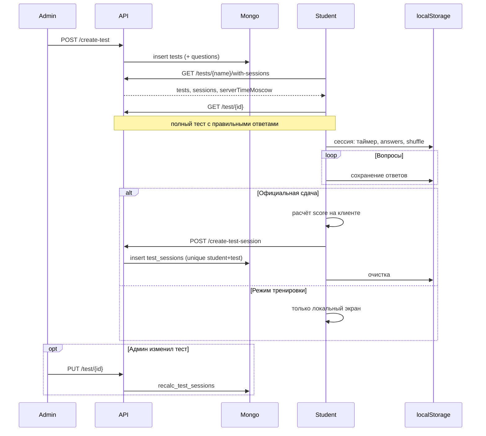
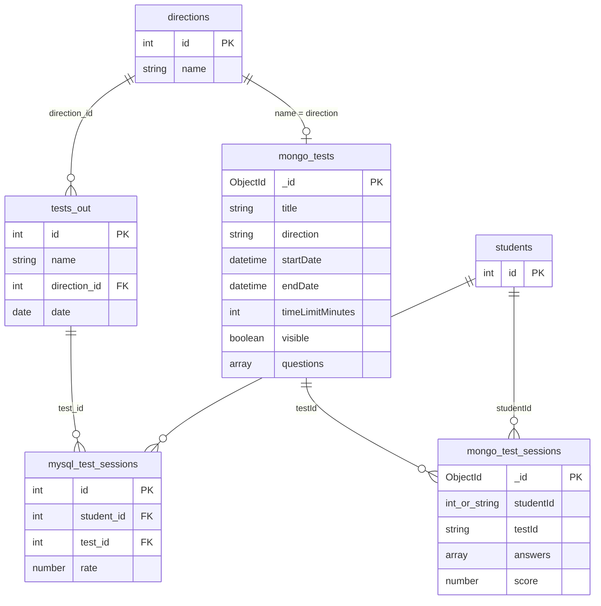

# 03. Тесты

## 1. Обзор

Модуль тестов — **гибрид MySQL + MongoDB**:

- **Внутренние тесты** платформы: определение и вопросы в MongoDB (`tests`), результаты в MongoDB (`test_sessions`).
- **Направления** (справочник): MySQL `directions` — связь с Mongo через **строковое имя** (`tests.direction = directions.name`).
- **Внешние тесты** (сдавались вне LMS): MySQL `tests_out` + результаты в MySQL **`test_sessions`** (это **другая** таблица, не Mongo!).

Критическая особенность архитектуры: **на бэкенде нет пошаговой сдачи** (`answer`, `submit`, `finish`). Незавершённая попытка живёт только во **фронтовом `localStorage`**. Сервер получает **один** запрос `POST /create-test-session` с уже готовым массивом ответов и итоговым `score`.

Доступность по календарю считается **строго по Москве** (`Europe/Moscow`). Для студента отдаётся `serverTimeMoscow`, чтобы UI не зависел от часов устройства.

Blueprints: `directions_bp`, `tests_bp`, `external_tests_bp` — **без префикса** `/api` (корневые пути exam-сервиса: `/directions`, `/tests/...`, `/create-test`, …).

---

## 2. Функциональная модель

### 2.1. Участники

| Роль | Управление тестами | Прохождение | Результаты |
|------|-------------------|-------------|------------|
| **admin** | CRUD, видимость, список сессий по тесту, сдача за любого студента | — | Все сессии, stats, отчёты |
| **student** | — | Загрузка вопросов, localStorage, `create-test-session` (только свой `studentId`) | Свои сессии и stats |
| **proctor / supervisor** | — | Те же read-эндпоинты с `@require_auth`, что и студент, **без** CRUD | Только **свои** сессии, если `id` совпадает |
| **Без auth** | — | — | Только `GET /directions` |

> **examinator** к модулю тестов в коде не привязан.

### 2.2. Два типа тестов

| Тип | Где хранится | ID в API | Прохождение на платформе |
|-----|--------------|----------|---------------------------|
| **Внутренний** | Mongo `tests` | ObjectId строкой | Да: таймер, вопросы, одна официальная попытка |
| **Внешний** | MySQL `tests_out` | `external_{mysql_id}` | Нет: только просмотр `rate` / `hasResult` |

Внешние тесты попадают в общий список `GET /tests/<direction>` и в студенческий `.../with-sessions`. Флаги: `isExternal`, `status: "external"`, `canStart` / `canPractice` = false.

### 2.3. Жизненный цикл внутреннего теста

#### Создание (admin)

1. Форма: название, направление (имя), `startDate`, `endDate`, `timeLimitMinutes`, вопросы, флаги `visible`, `isActive`.
2. `POST /create-test` — тело JSON сохраняется в Mongo как есть + `createdAt`; `visible` по умолчанию `false`.
3. Типы вопросов: `single`, `multiple`, `text` (см. раздел 3).

#### Прохождение (student)

1. **Список:** `GET /tests/<direction>/with-sessions` — тесты с флагами + все завершённые сессии студента + `stats` на каждую.
2. **Старт:** проверки на фронте (окно, не сдан, не external) → `GET /test/<id>` → перемешивание вопросов → запись в `localStorage`.
3. **В процессе:** ответы только в `localStorage`; таймер от `Date.now()` браузера (не серверный).
4. **Завершение:** расчёт на клиенте → `POST /create-test-session` (если не practice mode).
5. **Тренировка** (`practiceMode`): после официальной сдачи — повтор без записи в БД.
6. **Просмотр результатов:** `GET /test-session/<id>/stats` (+ при необходимости снова `GET /test/<id>`).

#### Управление после публикации (admin)

- `PUT /test/<id>` — обновление + **`recalc_test_sessions`** (пересчёт всех Mongo-сессий по актуальным вопросам).
- `PUT /test/<id>/toggle-visibility` — показ правильных ответов студенту (`visible`).
- `DELETE /test/<id>` — удаление теста и **всех** Mongo `test_sessions` с этим `testId`.

### 2.4. Статусы теста в списке (не путать с сессией)

Вычисляются в `tests_bp._with_flags` по **московскому** `now` и множеству `completed_ids`:

| `status` | Условие (внутренний тест) |
|----------|---------------------------|
| `available` | `startDate ≤ now ≤ endDate`, ещё не сдан |
| `upcoming` | `now < startDate` |
| `completed` | есть сессия в Mongo (или external с `hasResult`) |
| `missed` | `now > endDate`, не сдан |
| `external` | внешний тест |

**Флаги UI:**

| Флаг | Смысл |
|------|--------|
| `canStart` | В окне дат и не сдан |
| `canPractice` | Уже сдан (внутренний) |
| `canViewResults` | Сдан **и** (`visible` для student **или** роль не student) |
| `isActive` | Сейчас в окне дат (**не** поле `isActive` из формы админа) |

**Важно:** `completed_ids` заполняется **только для `role === "student"`**. У admin/proctor в списке `isCompleted` / `canViewResults` **не отражают** реальные сдачи других людей — список заточен под студенческий UI.

Различие двух list-эндпоинтов для `canViewResults`:

- `GET /tests/<direction>`: `(role != "student") OR visible`
- `GET /tests/<direction>/with-sessions`: **только** `visible` (эндпоинт только для student)

### 2.5. Сессия: клиент vs сервер

| | Клиент (`localStorage`) | Сервер (Mongo `test_sessions`) |
|--|-------------------------|--------------------------------|
| Когда | С момента «Начать» до submit/clear | Только после успешного `create-test-session` |
| Поля | `startTime`, `timeLimit`, `answers`, `questionOrder`, `isPracticeMode` | `studentId`, `testId`, `answers`, `score`, `timeSpentMinutes`, `completedAt` |
| Статус enum | Нет | Запись = «сдан»; повтор → **409** |
| Ограничение | — | Уникальный индекс `(studentId, testId)` |

### 2.6. Подсчёт баллов

#### При сдаче (основной путь — клиент)

| Тип вопроса | Правило на фронте |
|-------------|-------------------|
| `single` | `selectedAnswer` совпадает с **первым** вариантом `isCorrect: true` |
| `multiple` | all-or-nothing: все правильные выбраны, лишних нет |
| `text` | нормализованный ответ ∈ `correctAnswers` |

**Итог:** `score = round(сумма points / max points × 100)` → уходит в `create-test-session`.

**Сервер при insert:** не перепроверяет ответы; принимает `answers`, `points`, `isCorrect`, `score` из тела. Если `score` не передан — сумма `points` (может **не** быть процентом).

#### При пересчёте после правки теста (`recalc_test_sessions`)

Серверная логика `_score_single` / `_score_multiple` / `_score_text`:

- `single`: засчитывается **любой** выбранный id из множества правильных (расхождение с фронтом).
- `multiple`: `selected ⊆ correct` и `selected ∩ incorrect = ∅`.
- `score = int(round(earned / max × 100))`.

Новые вопросы в тесте → placeholder-ответ с 0 баллов. Удалённые вопросы в старых `answers` могут остаться в массиве.

### 2.7. Внешние тесты

- Создаются/ведутся **вне** этого API (MySQL).
- Студент видит название, дату, `hasResult`, `rate`, `sessionId` (MySQL).
- Сдать или тренироваться на платформе **нельзя**.

Отдельные роуты: `external_tests_bp` по числовому `direction_id` (MySQL id), не по имени в URL.

### 2.8. Связь с рейтингами

`calculate_ratings.py` агрегирует:

- Mongo: `test_sessions` по `studentId` (ищет `str(student_id)` — возможны пропуски, если в БД int).
- MySQL: `tests_out` + `test_sessions` (внешние `rate`).

Детали — в будущем разделе «Рейтинги».

### 2.9. Фронтенд (cpm-app)

| Компонент | Роль |
|-----------|------|
| `AdminFunctions/Tests/TestsManagement.js` | Список, удаление, visibility |
| `AdminFunctions/Tests/TestCreate.js` | Создание/редактирование |
| `AdminFunctions/Tests/TestResultsView.js` | Результаты по тесту |
| `StudentFunctions/Tests.js` | Список, старт, таймер, submit, practice |

---

## 3. Техническая модель

### 3.1. Хранилища

> В диаграмме `mysql_test_sessions` — таблица MySQL для **внешних** тестов. Mongo-коллекция тоже называется `test_sessions` — **разные хранилища**.

### 3.2. MongoDB: коллекция `tests`

| Поле | Описание |
|------|----------|
| `_id` | ObjectId |
| `title` | Название |
| `direction` | **Имя** направления (строка, не `directions.id`) |
| `startDate`, `endDate` | Окно сдачи (интерпретация — Москва) |
| `timeLimitMinutes` | Лимит на попытку (контроль на фронте) |
| `questions[]` | Массив вопросов |
| `visible` | Показывать разбор студенту (`canViewResults`) |
| `isActive` | Сохраняется с фронта; **не** используется в API доступности |
| `createdAt`, `updatedAt` | ISO UTC |

**Элемент `questions[]`:**

| Поле | Тип `single` / `multiple` | Тип `text` |
|------|---------------------------|------------|
| `questionId` | number | number |
| `type` | `single` \| `multiple` \| `text` | |
| `text` | текст вопроса | |
| `points` | баллы за вопрос | |
| `answers[]` | `{ id, text, isCorrect }` | — |
| `correctAnswers[]` | — | допустимые строки |

**Список (лёгкий):** projection без `questions` — `get_tests_by_direction`.

### 3.3. MongoDB: коллекция `test_sessions`

| Поле | Описание |
|------|----------|
| `_id` | ObjectId |
| `studentId` | int или string (MySQL `students.id`) |
| `testId` | string ObjectId теста |
| `testTitle` | денормализация |
| `answers[]` | см. ниже |
| `score` | 0–100 (%), обычно с клиента |
| `timeSpentMinutes` | опционально |
| `completedAt`, `createdAt` | ISO UTC |

**Элемент `answers[]`:**

| Поле | Когда |
|------|-------|
| `questionId`, `type` | всегда |
| `selectedAnswer` | single |
| `selectedAnswers` | multiple |
| `textAnswer` | text |
| `points`, `isCorrect` | всегда в сохранённой сессии |

**Индекс:** уникальный `(studentId, testId)` — создаётся при первом `create_test_session`.

### 3.4. MySQL

#### `directions`

Справочник: `get_directions()` → `SELECT * FROM directions`. Типично `id`, `name`.

#### `tests_out` — внешний тест

| Поле | Описание |
|------|----------|
| `id` | PK |
| `name` | Название |
| `direction_id` | → `directions.id` |
| `date` | Дата проведения |

#### `test_sessions` (MySQL) — результат внешнего теста

| Поле | Описание |
|------|----------|
| `id` | PK |
| `student_id` | → `students.id` |
| `test_id` | → `tests_out.id` |
| `rate` | Оценка |

### 3.5. Сопоставление направления

1. URL/API: `/tests/<direction>` — **`direction` = `directions.name`**.
2. Для external: `get_directions()` → найти объект по `name` → взять `id` → запросы к `tests_out`.

### 3.6. Файлы сервисов

| Файл | Назначение |
|------|------------|
| `get_directions.py` | MySQL directions |
| `get_tests_by_direction.py` | Mongo list + `get_test_by_id` (дубликат) |
| `create_test.py` | CRUD, visibility, delete+cascade |
| `create_test_session.py` | Сессии, stats, recalc, scoring |
| `get_external_tests.py` | MySQL external + format `external_*` |

---

## 4. API

### 4.1. Направления

#### `GET /directions`

| | |
|---|---|
| **Auth** | Нет |
| **Ответ** | Массив записей MySQL `directions` |
| **Сервис** | `get_directions()` |

---

### 4.2. Список тестов по направлению

#### `GET /tests/<direction>`

| | |
|---|---|
| **Auth** | `require_auth` |
| **Query** | `page`, `limit` — если передан хотя бы один, ответ **объект** с пагинацией; иначе **массив** |
| **Логика** | Mongo internal + MySQL external; обогащение `_with_flags`; `counts` по статусам |
| **Ответ (пагинация)** | `{ tests, external_tests: [], pagination, counts }` |
| **Элемент** | `id`, `title`/`name`, даты, `visible`, `status`, `canStart`, `canPractice`, `canViewResults`, `isExternal`, … |

#### `GET /tests/<direction>/with-sessions`

| | |
|---|---|
| **Auth** | `require_auth`; только **`role === student`** |
| **Ответ** | `{ tests, sessions[], serverTimeMoscow }` — у каждой session вложенный `stats` |
| **Ошибка** | 403 — не студент |

---

### 4.3. Тест (определение)

#### `GET /test/<test_id>`

| | |
|---|---|
| **Auth** | `require_auth` (любая роль) |
| **Ответ** | Полный документ Mongo, включая `questions` и **правильные ответы** |
| **Ошибка** | 404 |

#### `POST /create-test`

| | |
|---|---|
| **Auth** | `admin` |
| **Body** | JSON теста (см. раздел 3.2) |
| **Ответ** | `{ "id": "<mongo_id>" }` |

#### `PUT /test/<test_id>`

| | |
|---|---|
| **Auth** | `admin` |
| **Body** | `$set` полей |
| **Ответ** | `{ message, testId, recalc: { updated, sessions, error? } }` |

#### `DELETE /test/<test_id>`

| | |
|---|---|
| **Auth** | `admin` |
| **Ответ** | `{ message, testId, deletedSessions, totalDeleted }` |

#### `PUT /test/<test_id>/toggle-visibility`

| | |
|---|---|
| **Auth** | `admin` |
| **Ответ** | `{ message, visible, testId }` |

---

### 4.4. Сдача и сессии (Mongo)

#### `POST /create-test-session`

| | |
|---|---|
| **Auth** | `require_self_or_role('studentId', 'admin')` |
| **Body** | `{ studentId, testId, testTitle, answers[], score?, timeSpentMinutes? }` |
| **Успех** | `{ "id": "<session_id>" }` |
| **Конфликт** | **409** — тест уже сдан: `error`, `existingSessionId`, `existingScore`, `completedAt` |
| **Сервис** | `create_test_session()` |

**Формат `answers[]`:** `{ questionId, type, selectedAnswer? | selectedAnswers? | textAnswer?, points, isCorrect }`.

#### `GET /test-session/<session_id>`

| | |
|---|---|
| **Auth** | `require_auth`; **admin** или владелец `studentId` |
| **Ошибки** | 404, 403 |

#### `GET /test-sessions/student/<student_id>`

| | |
|---|---|
| **Auth** | `require_self_or_role('student_id', 'admin')` |
| **Ответ** | Краткий список сессий |

#### `GET /test-sessions/test/<test_id>`

| | |
|---|---|
| **Auth** | `admin` |
| **Ответ** | Все сдачи по тесту |

#### `GET /test-session/<session_id>/stats`

| | |
|---|---|
| **Auth** | как у GET session |
| **Ответ** | `totalQuestions`, `correctAnswers`, `accuracy`, `totalPoints`, `questionTypes`, `answers`, … |

#### `GET /test-session/student/<student_id>/test/<test_id>`

| | |
|---|---|
| **Auth** | `require_self_or_role('student_id', 'admin')` |
| **Ответ** | Полная сессия или 404 |

---

### 4.5. Внешние тесты (`external_tests_bp`)

#### `GET /external-tests/direction/<direction_id>`

| | |
|---|---|
| **Auth** | `require_auth` |
| **Логика** | student → с результатами; иначе → список для admin |
| **Примечание** | `direction_id` — **числовой** MySQL id |

#### `GET /external-tests/student/<student_id>/direction/<direction_id>`

| | |
|---|---|
| **Auth** | `require_self_or_role('student_id', 'admin')` |

Элемент внешнего теста: `id: "external_{id}"`, `name`, `date`, `isExternal`, `hasResult`, `rate`, `sessionId`.

---

### 4.6. Матрица доступа

| Эндпоинт | student | proctor | admin | публично |
|----------|---------|---------|-------|----------|
| GET /directions | | | | ✓ |
| GET /tests/\<dir\> | ✓* | ✓* | ✓* | |
| GET /tests/\<dir\>/with-sessions | ✓ | | | |
| GET /test/\<id\> | ✓ | ✓ | ✓ | |
| POST /create-test | | | ✓ | |
| PUT/DELETE /test/\<id\> | | | ✓ | |
| POST /create-test-session | свой id | | ✓ | |
| GET test-session(s)… | свои | свои** | ✓ | |
| GET /test-sessions/test/\<id\> | | | ✓ | |
| GET /external-tests/… | ✓ | ✓ | ✓ | |

\* флаги `completed` только осмысленны для student.  
\*\* только если `session.studentId == id` проктора (редкий случай).

---

## 5. Риски и неочевидная логика (чеклист для разработки)

1. **Доверие клиенту:** score и `isCorrect` не валидируются при `create-test-session`.
2. **Нет серверной проверки** окна `startDate–endDate` и `timeLimitMinutes` при сдаче.
3. **`GET /test/<id>`** отдаёт правильные ответы любому авторизованному пользователю.
4. **Две `test_sessions`:** Mongo vs MySQL — разные сущности, одно имя.
5. **`studentId` int/str** — уникальный индекс может не сработать; поиск сессий через `$in`.
6. **Scoring single:** фронт — первый correct; recalc — любой correct.
7. **`visible`:** бэкенд ограничивает `canViewResults`; фронт студента может показывать кнопку шире.
8. **`isActive` в форме** ≠ `isActive` в списке API.
9. **Таймер** — локальное время браузера; список — `serverTimeMoscow`.
10. **Пагинация списка** — in-memory после merge internal+external, не в Mongo.
11. **Ошибки MySQL external** в `tests_bp` глотаются (`except: pass`).
12. **Practice mode** не пишет в БД и не блокирует повторную официальную сдачу.

---

## 6. Ключевые файлы

| Назначение | Путь |
|------------|------|
| Роуты тестов | `cpm_back/blueprints/tests_bp.py` |
| Направления | `cpm_back/blueprints/directions_bp.py` |
| Внешние | `cpm_back/blueprints/external_tests_bp.py` |
| Mongo | `cpm_back/db/mongo.py` |
| Сессии, recalc | `cpm_back/services/exam/create_test_session.py` |
| CRUD теста | `cpm_back/services/exam/create_test.py` |

---

## 7. Открытые вопросы

- Серверная валидация сдачи (окно, пересчёт score, запрет утечки ответов).
- Единый тип `studentId` в Mongo и в рейтингах.
- CRUD внешних тестов через API или документировать только SQL.
- Явная роль `examinator` / `proctor` для просмотра результатов группы.

Следующие разделы: экзамены (отдельно от тестов), рейтинги, посещаемость…
