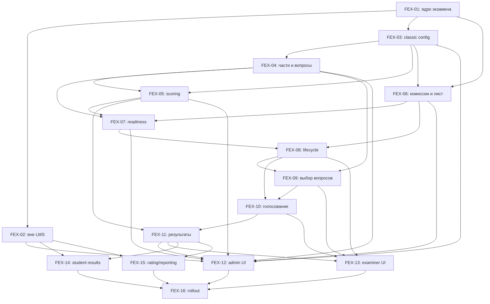

# Функциональная декомпозиция экзаменационной системы

## 1. Архитектурное решение

Новая система строится как единый экзаменационный домен в MySQL поверх существующих пользователей и `directions`.

- `exams` становится общей точкой для двух типов: `outside_lms` и `classic`.
- Старый контур `exams`/`exam_sessions` сохраняется для экзаменов вне LMS.
- Классический контур получает нормализованные сущности конфигурации, комиссий, назначений, сдач, вопросов, голосов и апелляций.
- Экзамен хранит `direction_id`, но не хранит собственное отображаемое название.
- Проведение работает через REST с ручным обновлением, optimistic version и транзакционной блокировкой.
- Итоговая оценка обоих типов интегрируется в текущий рейтинг.

## 2. Функциональные задачи

| ID | Функциональный блок | Результат | Зависит от |
|---|---|---|---|
| FEX-01 | [Единая модель экзамена и направления](./tasks/FEX-01-exam-core.md) | Оба типа экзамена имеют общий ID, тип и `direction_id` | — |
| FEX-02 | [Экзамен вне LMS](./tasks/FEX-02-outside-lms.md) | Ручное и массовое ведение старого типа результатов | FEX-01 |
| FEX-03 | [Конфигурация классического экзамена](./tasks/FEX-03-classic-config.md) | Период и правила постепенно настраиваемого экзамена | FEX-01 |
| FEX-04 | [Части и банк вопросов](./tasks/FEX-04-question-bank.md) | Части A–Z, вопросы/ответы TEXT, ручной ввод и Excel | FEX-03 |
| FEX-05 | [Подсчёт и шкала](./tasks/FEX-05-scoring.md) | Веса, min/max, пороги 0–5 и спорный результат | FEX-03, FEX-04 |
| FEX-06 | [Комиссии, лист и привилегии](./tasks/FEX-06-assignments.md) | Составы 1–6, назначения, замены, импорт/просмотр | FEX-01, FEX-03 |
| FEX-07 | [Валидатор готовности](./tasks/FEX-07-readiness.md) | Единый набор блокирующих ошибок перед стартом | FEX-04, FEX-05, FEX-06 |
| FEX-08 | [Жизненный цикл сдачи](./tasks/FEX-08-attempt-lifecycle.md) | Ожидание, готовность полного состава, старт и REST-конкурентность | FEX-06, FEX-07 |
| FEX-09 | [Выдача и замена вопросов](./tasks/FEX-09-question-selection.md) | Квоты, случайная выдача, привилегии и второй круг | FEX-04, FEX-08 |
| FEX-10 | [Голосование комиссии](./tasks/FEX-10-voting.md) | Скрытые голоса, консенсус и неограниченные переголосования | FEX-08, FEX-09 |
| FEX-11 | [Результат, пересдача и апелляция](./tasks/FEX-11-results.md) | Публикация, одна пересдача, override оценки и физическое удаление | FEX-05, FEX-10 |
| FEX-12 | [Рабочее место администратора](./tasks/FEX-12-admin-workspace.md) | Полный desktop-first интерфейс управления | FEX-02–FEX-11 |
| FEX-13 | [Кабинет экзаменатора](./tasks/FEX-13-examiner-ui.md) | Mobile/desktop проведение без realtime-транспорта | FEX-08–FEX-11 |
| FEX-14 | [Результаты студента](./tasks/FEX-14-student-results.md) | Mobile-first результаты и разрешённые протоколы | FEX-02, FEX-11 |
| FEX-15 | [Рейтинг и отчётность](./tasks/FEX-15-rating-reporting.md) | Оба типа участвуют в рейтинге и сводных отчётах | FEX-02, FEX-11 |
| FEX-16 | [Совместимость и ввод в эксплуатацию](./tasks/FEX-16-rollout.md) | Миграция legacy, безопасность, нагрузка и приёмочный контур | FEX-01–FEX-15 |

Все задачи имеют отдельную dev-ready постановку в каталоге [development](./development/).

## 3. Карта зависимостей

## 4. Рекомендуемая последовательность

### Волна 1 — фундамент

FEX-16 preflight → FEX-01 → FEX-02 и FEX-03 → FEX-04 и FEX-06 → интеграция FEX-05. Чистый scoring engine можно писать параллельно FEX-04, его SQL/API зависит от parts.

### Волна 2 — проведение

FEX-07 → FEX-08 → FEX-09 → FEX-10 → FEX-11.

### Волна 3 — пользовательские интерфейсы и интеграции

После стабилизации контрактов FEX-08–FEX-11 можно параллельно выполнять FEX-12, FEX-13, FEX-14 и FEX-15.

### Волна 4 — ввод в эксплуатацию

FEX-16 начинается с preflight схемы ДО реализации миграций и сопровождает все волны; rollout — завершающий этап. Её нельзя отложить целиком после FEX-15.

## 5. Архитектурные инварианты

- Имя экзамена всегда вычисляется по `directions`; копии имени нет.
- MySQL — единственное хранилище классических экзаменов.
- Значения баллов хранятся в `DECIMAL`, а не `FLOAT`.
- Любой показанный вопрос и голос воспроизводимы из протокола до физического удаления.
- Ни один frontend не является источником истины для подсчёта, квот, прав или состояния сдачи.
- Удаление экзамена или истории студента физическое и каскадное.
- Нет WebSocket, WebRTC, long polling или фонового polling.
- Переходы защищены stateVersion/questionId; независимые votes — roundId/actor; все mutations транзакционны и idempotent.
- Студент не участвует в процессе сдачи через интерфейс.
